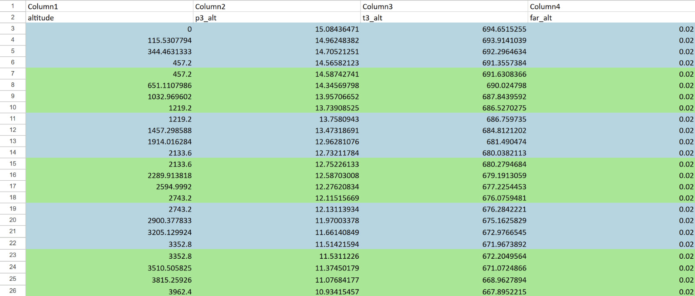

# Excel Data Expander

This Python program reads data from very specifically formatted Excel files, processes and expands the data based on specific rules, and then writes the processed data back to a new Excel file with alternating row colors for better readability.


before


after

## Features

- **Parse Cell Content**: Extracts numeric values from cell content using regular expressions.
- **Expand Data**: Processes each cell to extract up to four numeric values and places them in separate rows.
- **Preserve Header**: Copies the first two rows directly to the new expanded data.
- **Alternate Row Colors**: Applies alternating colors to rows for better visual distinction in the output Excel file.

## Prerequisites

- Python 3.x
- pandas
- numpy
- openpyxl

## Installation

Install the required Python libraries using pip:

```sh
pip install pandas numpy openpyxl
```

## Usage

1. Run the script.
2. Choose the directory of your Excel file and the directory where the new file should be saved.
3. Click on start.

## Code Explanation

### Import Libraries

```python
import pandas as pd
import numpy as np
import re
from openpyxl import load_workbook
from openpyxl.styles import PatternFill
```

### Define the Function to Parse Cell Content

```python
def parse_cell(cell):
    try:
        points = re.findall(r"[-+]?\d*\.\d+|\d+", cell)
        points = [float(point) for point in points]
        return points
    except Exception as e:
        print(f"Error parsing cell: {cell}, error: {e}")
        return []
```

### Read and Process the Excel File

```python
input_file = r"C:/Users/franz/Desktop/python/nox_emissions_data_p3t3.xlsx"  
df = pd.read_excel(input_file, header=None)
expanded_data = []

for r in range(2):
    expanded_data.append(df.iloc[r, :].values.tolist())

for r in range(2, df.shape[0]):
    new_rows = [[] for _ in range(4)]
    for c in range(df.shape[1]):
        cell_content = df.iat[r, c]
        points = parse_cell(str(cell_content))
        for i, point in enumerate(points):
            if i < 4:
                while len(new_rows[i]) < c:
                    new_rows[i].append(np.nan)
                new_rows[i].append(point)
    max_len = max(len(row) for row in new_rows)
    for row in new_rows:
        while len(row) < max_len:
            row.append(np.nan)
    expanded_data.extend(new_rows)

expanded_df = pd.DataFrame(expanded_data)
output_file = r"C:/Users/franz/Desktop/python/tooooll.xlsx"  
expanded_df.to_excel(output_file, index=False, header=False)
```

### Apply Formatting to the Output Excel File

```python
wb = load_workbook(output_file)
ws = wb.active

blue_fill = PatternFill(start_color="ADD8E6", end_color="ADD8E6", fill_type="solid")
green_fill = PatternFill(start_color="90EE90", end_color="90EE90", fill_type="solid")

for r in range(2, ws.max_row):
    fill = blue_fill if ((r - 2) // 4) % 2 == 0 else green_fill
    for cell in ws[r + 1]:
        cell.fill = fill

wb.save(output_file)
```
